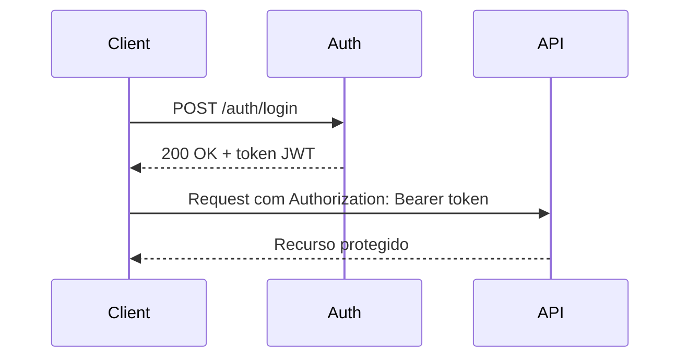
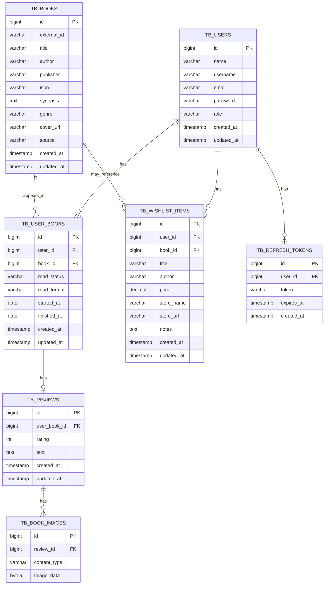
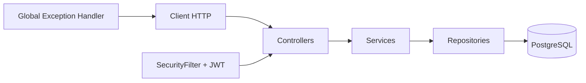

# Esquema da API - Virtual Library

Este documento descreve o estado atual da API da biblioteca virtual: recursos, rotas, autenticacao, DTOs principais e modelo de dados.

## Visao geral

A API permite:

- cadastrar e autenticar usuarios;
- gerenciar livros do catalogo;
- pesquisar livros por titulo, autor, genero ou ISBN;
- gerenciar a biblioteca pessoal do usuario autenticado;
- acompanhar status de leitura e formato de leitura.

Recursos que existem no banco/modelo, mas ainda parecem estar em desenvolvimento:

- reviews;
- imagens de reviews;
- wishlist;
- refresh tokens.

## Autenticacao

A API usa JWT. O usuario faz login em `/auth/login`, recebe um token e envia esse token nas proximas requisicoes autenticadas.

Fluxo esperado:



Rotas publicas:

- `POST /auth/register`
- `POST /auth/login`

Rotas protegidas:

- todas as outras rotas exigem usuario autenticado;
- rotas de escrita em `/books` exigem usuario com role `ADMIN`.

## Regras de acesso

| Recurso | USER | ADMIN |
| --- | --- | --- |
| Login e cadastro | Sim | Sim |
| Listar livros | Sim | Sim |
| Buscar livros | Sim | Sim |
| Ver livro por id | Sim | Sim |
| Criar livro | Nao | Sim |
| Atualizar livro | Nao | Sim |
| Deletar livro | Nao | Sim |
| Ver propria conta | Sim | Sim |
| Atualizar propria conta | Sim | Sim |
| Deletar propria conta | Sim | Sim |
| Gerenciar propria biblioteca | Sim | Sim |

## Endpoints

### Auth

| Metodo | Rota | Auth | Descricao | Request | Response | Status |
| --- | --- | --- | --- | --- | --- | --- |
| `POST` | `/auth/register` | Publica | Cadastra um novo usuario | `RegisterDTO` | DTO de sucesso | `201 Created` |
| `POST` | `/auth/login` | Publica | Autentica o usuario | `AuthenticationDTO` | `LoginResponseDTO` | `200 OK` |

### Books

| Metodo | Rota | Auth | Descricao | Request | Response | Status |
| --- | --- | --- | --- | --- | --- | --- |
| `POST` | `/books` | ADMIN | Cria livro no catalogo | `BookRequestDTO` | `BookResponseDTO` | `201 Created` |
| `GET` | `/books` | Autenticado | Lista livros do catalogo | - | `List<BookResponseDTO>` | `200 OK` |
| `GET` | `/books/{bookId}` | Autenticado | Busca livro por id | - | `BookResponseDTO` | `200 OK` |
| `PUT` | `/books/{bookId}` | ADMIN | Atualiza livro | `BookRequestDTO` | `BookResponseDTO` | `200 OK` |
| `DELETE` | `/books/{bookId}` | ADMIN | Remove livro | - | - | `204 No Content` |
| `GET` | `/books/search` | Autenticado | Busca livros por filtros | Query params | `List<BookSearchResponseDTO>` | `200 OK` |

Parametros aceitos em `/books/search`:

| Parametro | Tipo | Obrigatorio | Exemplo |
| --- | --- | --- | --- |
| `title` | `String` | Nao | `/books/search?title=clean` |
| `author` | `String` | Nao | `/books/search?author=martin` |
| `genre` | `String` | Nao | `/books/search?genre=software` |
| `isbn` | `String` | Nao | `/books/search?isbn=9780132350884` |

### Users

| Metodo | Rota | Auth | Descricao | Request | Response | Status |
| --- | --- | --- | --- | --- | --- | --- |
| `GET` | `/users/me` | Autenticado | Retorna o usuario logado | - | `UserResponseDTO` | `200 OK` |
| `PATCH` | `/users/me` | Autenticado | Atualiza o usuario logado | `UserUpdateDTO` | `UserResponseDTO` | `200 OK` |
| `DELETE` | `/users/me` | Autenticado | Remove o usuario logado | - | - | `204 No Content` |

### User Books

| Metodo | Rota | Auth | Descricao | Request | Response | Status |
| --- | --- | --- | --- | --- | --- | --- |
| `POST` | `/users/me/books` | Autenticado | Adiciona livro na biblioteca do usuario logado | `UserBookRequestDTO` | `UserBookResponseDTO` | `201 Created` |
| `GET` | `/users/me/books` | Autenticado | Lista livros do usuario logado | - | `List<UserBookResponseDTO>` | `200 OK` |
| `PATCH` | `/users/me/books/{bookId}` | Autenticado | Atualiza status/formato de um livro do usuario logado | `UserBookUpdateDTO` | `UserBookResponseDTO` | `200 OK` |
| `DELETE` | `/users/me/books/{bookId}` | Autenticado | Remove livro da biblioteca do usuario logado | - | - | `204 No Content` |

## DTOs principais

### RegisterDTO

```json
{
  "name": "Jane Doe",
  "username": "janedoe",
  "email": "jane@example.com",
  "password": "123456",
  "role": "USER"
}
```

### AuthenticationDTO

```json
{
  "username": "janedoe",
  "password": "123456"
}
```

### LoginResponseDTO

```json
{
  "token": "jwt-token"
}
```

### BookRequestDTO

```json
{
  "externalId": "google-books-id",
  "title": "Clean Code",
  "author": "Robert C. Martin",
  "publisher": "Prentice Hall",
  "isbn": "9780132350884",
  "synopsis": "Book description",
  "genre": "Software Engineering",
  "coverUrl": "https://example.com/cover.jpg"
}
```

### BookResponseDTO

```json
{
  "id": 1,
  "externalId": "google-books-id",
  "title": "Clean Code",
  "author": "Robert C. Martin",
  "publisher": "Prentice Hall",
  "isbn": "9780132350884",
  "synopsis": "Book description",
  "genre": "Software Engineering",
  "coverUrl": "https://example.com/cover.jpg",
  "source": "MANUAL"
}
```

### UserResponseDTO

```json
{
  "name": "Jane Doe",
  "username": "janedoe",
  "email": "jane@example.com",
  "role": "USER"
}
```

### UserUpdateDTO

```json
{
  "name": "Jane Doe",
  "username": "janedoe",
  "email": "jane@example.com",
  "password": "new-password"
}
```

### UserBookRequestDTO

```json
{
  "bookId": 1,
  "readStatus": "READING",
  "readFormat": "KINDLE",
  "startedAt": "2026-08-11",
  "finishedAt": null
}
```

### UserBookResponseDTO

```json
{
  "id": 1,
  "book": {
    "id": 1,
    "title": "Clean Code",
    "author": "Robert C. Martin"
  },
  "readStatus": "READING",
  "readFormat": "KINDLE",
  "startedAt": "2026-08-11",
  "finishedAt": null,
  "createdAt": "2026-08-11T10:00:00",
  "updatedAt": "2026-08-11T10:00:00"
}
```

## Enums

### Role

```text
USER
ADMIN
```

### ReadStatus

```text
READING
FINISHED
WISHLIST
```

### ReadFormat

```text
KINDLE
PHYSIC
PDF
AUDIOBOOK
```

## Modelo de dados



## Arquitetura atual



## Padrao de responses

Sucesso:

- usar DTOs para respostas com corpo;
- usar `201 Created` em criacoes;
- usar `204 No Content` em deletes.

Erro:

- usar `RestErrorMessage`;
- evitar mensagens soltas em texto puro.

Exemplo de erro:

```json
{
  "status": 404,
  "message": "Book not found",
  "timestamp": "2026-08-11T10:00:00"
}
```

## Proximos recursos possiveis

### Reviews

Endpoints sugeridos:

| Metodo | Rota | Auth | Descricao |
| --- | --- | --- | --- |
| `POST` | `/users/me/books/{bookId}/reviews` | Autenticado | Criar review do livro do usuario |
| `GET` | `/users/me/books/{bookId}/reviews` | Autenticado | Buscar review do usuario para o livro |
| `PATCH` | `/users/me/books/{bookId}/reviews` | Autenticado | Atualizar review |
| `DELETE` | `/users/me/books/{bookId}/reviews` | Autenticado | Remover review |

### Wishlist

Endpoints sugeridos:

| Metodo | Rota | Auth | Descricao |
| --- | --- | --- | --- |
| `POST` | `/users/me/wishlist` | Autenticado | Adicionar item na wishlist |
| `GET` | `/users/me/wishlist` | Autenticado | Listar wishlist |
| `PATCH` | `/users/me/wishlist/{itemId}` | Autenticado | Atualizar item |
| `DELETE` | `/users/me/wishlist/{itemId}` | Autenticado | Remover item |

### Refresh Token

Endpoints sugeridos:

| Metodo | Rota | Auth | Descricao |
| --- | --- | --- | --- |
| `POST` | `/auth/refresh` | Publica | Gerar novo access token usando refresh token |
| `POST` | `/auth/logout` | Autenticado | Invalidar refresh token |

## Melhorias futuras

- adicionar Swagger/OpenAPI para documentacao interativa;
- adicionar validacoes completas em `RegisterDTO` e `UserUpdateDTO`;
- criar testes de controller para status HTTP e autorizacao;
- ativar perfil de teste com H2 ou Testcontainers;
- implementar reviews;
- implementar wishlist;
- implementar refresh token;
- padronizar nomes de pacotes para letras minusculas;
- adicionar paginacao em listagens;
- adicionar ordenacao e filtros nas listagens;
- melhorar contrato de erro para validacoes de campos.
